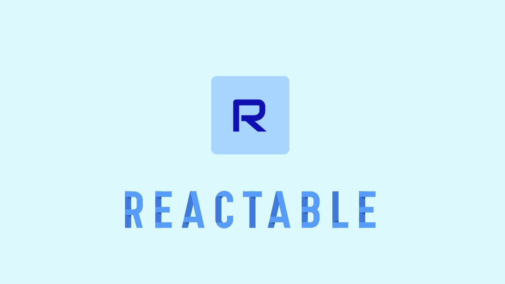

[](https://pub.dev/packages/reactable)
[](https://pub.dev/packages/reactable)
[](https://pub.dev/packages/reactable) 
[](https://codecov.io/gh/SchabanBo/reactable)

This is a flutter reactive state management library that automatically updates the UI when values of an reactable objects change .It is easy, light, fast and well tested.
It has two main parts:

- Reactable: The value holder, the value could be any of any type.
- Scope: The pieces of code the should be updated whenever a reactable in this code has been changed.

in a simple way the scope will be updated every time the reactable in the builder method of this scope has been updated.

## Reactable

To create a reactable you have two ways

```dart
var counter = 0.asReactable;
// OR
var counter = Reactable(0);
```

you can create reactable for a list or map (This are the supported type until now)

```dart
final map = <String, int>{}.asReactable;
// OR
var list = ReactableList([0,1,2]);
```

this will update the list/map whenever an item add or deleted
**Note:** When updating an item in the list/map, the reactable will not be updated automatically, you should call `refresh()`.

## Scope

This widget will add a listener for every reactable inside of it (and will remove the listener when the scope is removed/disposed).
This means this widget will be automatically notified with the reactable changes.
You could pass a condition to this scope to only get updated when the result is true.

```dart
// This will update the counter only when the value is even number
Scope(
    where: () => counter.value % 2 == 0,
    builder: (_) => Text(
        '$counter',
        style: Theme.of(context).textTheme.headline4,
    ),
)
```

## More features

### Reactable.read

If you want to read a reactable without registering a listener in a scope for this reactable.

### Reactable.write

If you want to change a reactable value without notifying the listeners

### Scope.where

Set a condition on when should this scope be updated.

### Scope.debug

If want to see more information of what is happening in the scope, set this value to true. Or set it true for the all scopes be *reactableContext.debugReactable*

## Scope.throwOnError

by default the scope will throw an error if no reactable is within it. you can change this behavior with the [throwOnError] parameter. Or set it false for the all scopes be *reactableContext.reactableThrowOnError*

## Scope.autoDispose

if this value is true, the reactable in the scope will be disposed after removing the widget from the screen and there is no other scopes that are using this reactable.

**NOTE:** if a reactable is disposed it cannot be used again.

By default this is true, you can set it false for the all scopes be *reactableContext.autoDispose*

